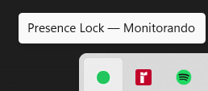
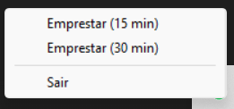
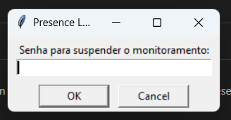

# Presence Lock

Bloqueia automaticamente o Windows quando você sai — detecta a presença do seu iPhone via Bluetooth e trava a tela em ~10 segundos após o celular sair de alcance ou ter o Bluetooth desligado.

Roda discreta na bandeja do sistema, sem janelas abertas.

---

## Screenshots

| Monitorando | Menu | Suspender |
|:-----------:|:----:|:---------:|
|  |  |  |

---

## Como funciona

- A cada segundo tenta conectar via Bluetooth ao iPhone configurado
- **2 falhas consecutivas** (~10 s) → bloqueia a tela com `LockWorkStation()`
- O Windows já pede senha no desbloqueio — nenhuma ação adicional necessária
- Ícone **verde** = monitorando | Ícone **amarelo** = suspenso (modo emprestar)

---

## Requisitos

- Windows 10/11
- Python 3.11 ou superior → [python.org](https://www.python.org/downloads/)
- Bluetooth ativo no computador
- iPhone com Bluetooth ligado (sem necessidade de pareamento)

---

## Instalação

```bash
git clone https://github.com/Carvalho-99/presence-lock.git
cd presence-lock

python -m venv venv
venv\Scripts\activate

pip install -r requirements.txt
```

---

## Configuração

Edite o arquivo `config.py`:

```python
LOCK_PASSWORD = "SUA SENHA"          # senha para suspender ou fechar o app

PHONE_MAC = "EC:CE:D7:DF:65:37"  # MAC Bluetooth do seu iPhone
                                   # Configurações → Geral → Informações → Bluetooth

SCAN_INTERVAL = 1                  # segundos entre cada tentativa
MAX_MISSES    = 2                  # falhas antes de bloquear  →  (1+4)×2 ≈ 10s
```

### Como encontrar o MAC Bluetooth do iPhone

1. Abra **Ajustes → Geral → Informações**
2. Role até **Bluetooth** — copie o endereço (formato `XX:XX:XX:XX:XX:XX`)

### Ajustando o tempo de bloqueio

| `SCAN_INTERVAL` | `MAX_MISSES` | Tempo até bloquear |
|:---:|:---:|:---:|
| 1s | 2 | ~10s |
| 1s | 3 | ~15s |
| 2s | 2 | ~14s |
| 3s | 3 | ~21s |

---

## Executar

**Com terminal (para testar):**
```bash
venv\Scripts\python.exe main.py
```

**Sem janela (uso normal):**
```
Duplo clique em start.bat
```

---

## Iniciar automaticamente com o Windows

Abra o PowerShell e execute uma única vez:

```powershell
$wsh = New-Object -ComObject WScript.Shell
$shortcut = $wsh.CreateShortcut("$env:APPDATA\Microsoft\Windows\Start Menu\Programs\Startup\presence-lock.lnk")
$shortcut.TargetPath = "C:\presence-lock\start.bat"
$shortcut.WorkingDirectory = "C:\presence-lock"
$shortcut.WindowStyle = 7
$shortcut.Save()
```

Para verificar:
```powershell
ls "$env:APPDATA\Microsoft\Windows\Start Menu\Programs\Startup\"
# deve aparecer presence-lock.lnk
```

---

## Menu da bandeja

| Opção | Comportamento |
|-------|---------------|
| **Emprestar (15 min)** | Pede senha → suspende o monitoramento por 15 minutos com contagem regressiva no tooltip |
| **Emprestar (30 min)** | Mesmo fluxo, 30 minutos |
| **Sair** | Pede senha → encerra o programa |

---

## Estrutura do projeto

```
presence-lock/
├── main.py          # Entry point + AppState (estado compartilhado entre threads)
├── monitor.py       # Detecção Bluetooth + bloqueio de tela
├── tray.py          # Ícone na bandeja, menus, timer de suspensão
├── config.py        # Senha, MAC do iPhone e intervalos
├── requirements.txt # Dependências Python
├── start.bat        # Inicia sem janela (pythonw)
└── docs/
    └── screenshots/ # Imagens do README
```

---

## Dependências

| Pacote | Uso |
|--------|-----|
| [pystray](https://github.com/moses-palmer/pystray) | Ícone e menu na bandeja do sistema |
| [Pillow](https://python-pillow.org/) | Geração do ícone colorido |

Detecção Bluetooth usa apenas a biblioteca padrão do Python (`socket` com `AF_BTH`).

---

## Licença

MIT
